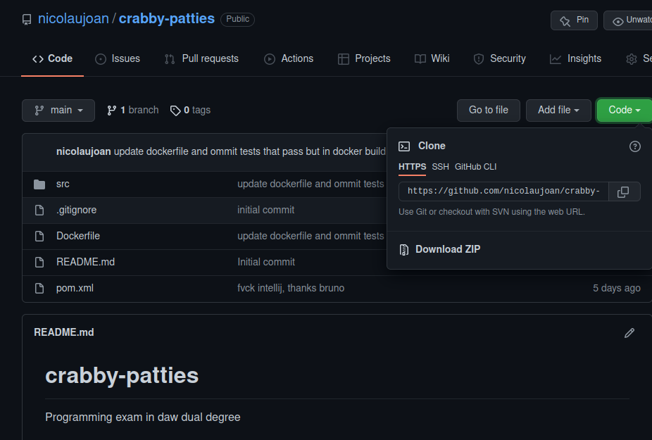
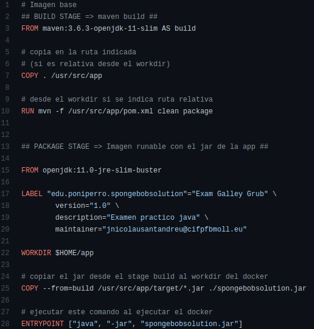
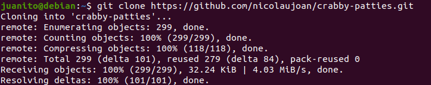
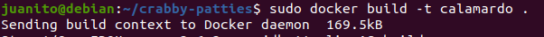
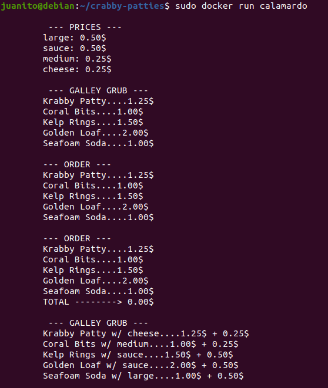
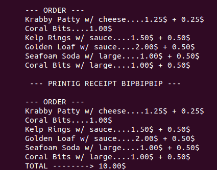

# exam-dockerized
Dockerized Daw Dual Exam, designed by our teacher <a href="https://github.com/dfleta">dfleta</a> and explained in his <a href="https://github.com/dfleta/examen-galley-grub">repo</a> with all the requirements, UML diagram ...

We take advantage of the creation and usage of our Azure VM created to dockerize an app. So, we will dockerize our exam and run its container in our Debian VM.

First, clone the repo of my solution:

this Dockerfile will be used

we have git installed in our Debian VM, so we clone the solution

now execute the build command

and run a container to see the output of the app

